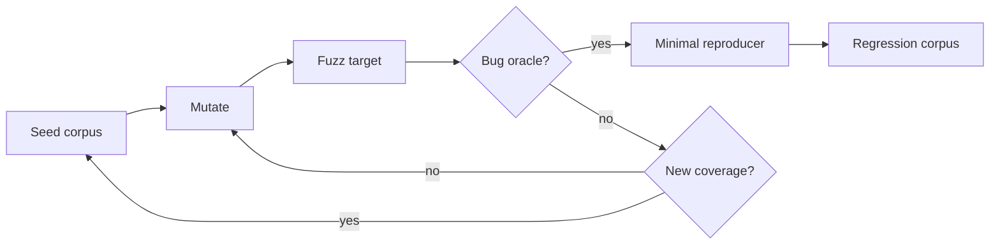

# Coverage-Guided Fuzzing, Corpus Design & Sanitizer Oracles

## Konu anlatımı
Coverage-guided fuzzing, generated/mutated input'lardan yeni execution coverage üretenleri corpus'ta tutup onların varyasyonlarını keşfeder. Özellikle parsers, codecs, protocol handlers, serialization ve native security boundaries için example-based testlerin elle kapsayamadığı malformed-input uzayını tarar.

Generator tek başına yeterli değildir; bug'ı görünür kılan oracle gerekir. Crash/assert en basit oracle'dır. ASan memory-safety, UBSan undefined behavior gibi hataları erken sinyale çevirir. Differential testing iki implementation sonucunu; invariant/metamorphic oracle ise `decode(encode(x)) == x` gibi ilişkileri kontrol eder.

## Mental model

## İçeride ne oluyor?
1. Target hızlı, deterministic ve dar kapsamlı tutulur.
2. Seed corpus valid ve invalid küçük örneklerle structured state'lere başlangıç verir.
3. Coverage instrumentation execution feedback üretir.
4. Yeni coverage üreten input corpus'a alınır; corpus minimize edilebilir.
5. Sanitizers memory/UB hatalarını güçlü oracle'a dönüştürür.
6. Crash input minimize edilip regression test/corpus'a alınır.
7. Yüksek coverage correctness kanıtı değildir; zayıf oracle semantic bug'ları kaçırabilir.

## Mülakat soruları
- Random testing ile coverage-guided fuzzing farkı nedir?
- Seed corpus neden önemlidir?
- Target neden deterministic ve hızlı olmalıdır?
- Yüksek coverage correctness anlamına gelir mi?
- Senior: sanitizer fuzzing'in gücünü neden artırır?
- Staff: grammar-aware mutation ne zaman byte mutation'dan üstündür?
- Staff: PR testleri ve continuous fuzzing resource budget'ını nasıl ayırırsın?

## Beklenen cevap seviyesi
- **Junior:** malformed input, corpus ve crash oracle'ı açıklar.
- **Mid:** feedback loop, seed/minimization ve deterministic target'ı bilir.
- **Senior:** sanitizer, differential ve invariant oracle'ları birlikte kullanır.
- **Staff:** continuous fuzzing, corpus lifecycle, flake control ve security triage tasarlar.

## Mini alıştırma
URL parser için boş input, minimal valid URL, Unicode host, percent encoding, long path, invalid UTF-8, duplicate delimiters ve embedded NUL seed'leri seç. Her birinin hedeflediği parser state'ini ve iki invariant'ı yaz.

## Proje fikri
Küçük JSON/URL parser için libFuzzer target yaz; ASan+UBSan ile çalıştır. Seed corpus oluştur, corpus minimize et ve bulunan her crash'i minimal reproducer + regression test'e çevir. Sonra reference parser ile differential oracle ekle.

## Failure modes / trade-off
Nondeterminism corpus'u şişirir; yavaş target exploration'ı öldürür; global state testleri kirletir. Coverage metric'ini tek hedef yapmak semantic state'leri kaçırır. Triage edilmeyen crash backlog'u continuous fuzzing'in operasyonel değerini düşürür.

## Production bağlantısı
Network/file parsers, codecs, protocol boundaries, serialization ve security-sensitive native code continuous fuzzing için yüksek getirili hedeflerdir. Crash artifacts release regression suite'e taşınmalı; sanitizer ve fuzz findings ownership/SLA ile triage edilmelidir.

## Güncel teknoloji notu
LLVM'nin güncel libFuzzer dokümantasyonu motorun önemli bug fix'leriyle desteklendiğini, fakat özgün yazarların aktif yeni özellik geliştirmeyi bırakıp Centipede'e geçtiğini belirtiyor. Kalıcı mülakat bilgisi belirli motor isminden çok feedback-guided search, corpus ve oracle tasarımıdır.

## Kaynaklar
- LLVM — libFuzzer: https://llvm.org/docs/LibFuzzer.html
- Clang — SanitizerCoverage: https://clang.llvm.org/docs/SanitizerCoverage.html
- Clang — AddressSanitizer: https://clang.llvm.org/docs/AddressSanitizer.html
- Google — OSS-Fuzz: https://google.github.io/oss-fuzz/
