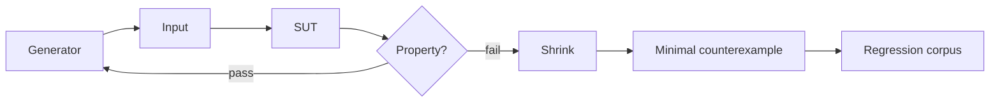

# Property-Based Testing: Generators, Shrinking & Oracles

## Konu anlatımı
Example-based test seçilmiş input/output örneklerini doğrular. Property-based testing (PBT) ise önce genel invariant'ı tanımlar, sonra bu invariant'ı çok sayıda generated input üzerinde falsify etmeye çalışır. Üç temel parça vardır: **generator/strategy** input uzayını üretir; **property/oracle** doğru davranışın gözlenebilir invariant'ını ifade eder; **shrinker** failure'ı daha küçük, teşhis edilebilir counterexample'a indirger.

Sorting için `output sorted`, `same multiset` ve idempotence gibi properties kullanılabilir. Tam expected output'u üretmenin zor olduğu sistemlerde metamorphic relations, differential oracle veya basit reference model kullanılabilir.

## Mental model

## İçeride ne oluyor?
- Generator distribution bug-finding gücünün parçasıdır; yalnız random olmak yeterli değildir.
- Ağır `filter` kullanımı test budget'ını geçersiz adaylarda tüketebilir; constraint-aware generator tercih edilir.
- Shrinking failure-preserving küçük adaylar arayarak debugging maliyetini düşürür.
- Algebraic properties: idempotence, inverse/round-trip, commutativity/associativity yalnız domain gerçekten garanti ediyorsa kullanılmalıdır.
- Differential testing bağımsız implementations sonuçlarını kıyaslayabilir.
- Metamorphic testing tam oracle yerine input/output ilişkilerini doğrular.
- Stateful PBT operation sequence + reference model ile API state machine'lerini test edebilir.
- Güncel Hypothesis dokümantasyonu explicit, reuse, generate, target, shrink ve explain fazlarını ayırır; önceki failure örnekleri tekrar kullanılabilir.

## Mülakat soruları
1. PBT ile fuzzing arasındaki fark nedir?
2. Shrinking neden önemlidir?
3. Generator distribution neden test correctness'inin bir parçasıdır?
4. Exact oracle yoksa ne kullanırsın?
5. Round-trip property hangi bug'ları kaçırabilir?
6. Stateful API için reference model nasıl kurulur?
7. PBT, coverage-guided fuzzing, deterministic concurrency ve contract tests CI'da nasıl birlikte konumlanır?

## Beklenen cevap seviyesi
- **Junior:** example vs property ve invariant farkını açıklar.
- **Mid:** generator, shrinker, round-trip ve metamorphic property kurar.
- **Senior:** stateful model, differential oracle, distribution bias ve nondeterminism'i tartışır.
- **Staff:** teknikleri failure class, runtime budget, reproducibility ve ownership'e göre portföy halinde tasarlar.

## Mini alıştırma
URL normalizer için idempotence, parse/serialize, scheme/host case, percent-encoding ve invalid-input properties yaz. Naive random string yerine domain-aware generator'ın scheme, authority, path, query ve fragment'i nasıl ayrı üreteceğini tasarla.

## Proje fikri
Interval-set veya LRU cache yaz; basit reference model ile random operation sequences karşılaştır. Failure'ı shrink et ve minimal sequence'i regression corpus'a ekle. CI budget'ını ve reproducibility politikasını belgeleyin.

## Failure modes / trade-off / production
Implementation'ı oracle olarak yeniden yazmak correlated bugs yaratır. Aşırı filtering coverage'i düşürür. Yalnız round-trip iki tarafın aynı hatayı paylaşmasını kaçırabilir. Nondeterminism shrinking'i kararsızlaştırır. Production incident counterexample'larını regression corpus'a geri beslemek güçlü bir öğrenme döngüsüdür.

## Kaynaklar
- Hypothesis 6.168 — Settings/phases: https://hypothesis.readthedocs.io/en/latest/settings.html
- Hypothesis 6.168 — Glossary: https://hypothesis.readthedocs.io/en/latest/glossary.html
- Hypothesis — External fuzzers: https://hypothesis.readthedocs.io/en/latest/how-to/external-fuzzers.html
- Claessen/Hughes lineage — How to Specify It!: https://research.chalmers.se/en/publication/517894
